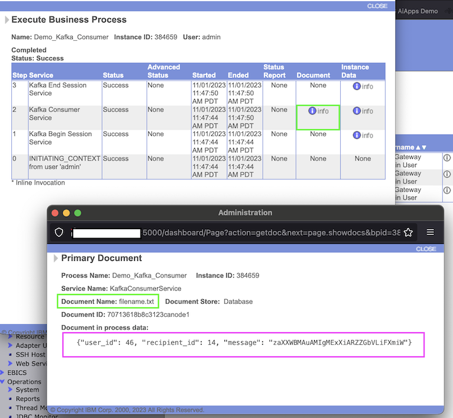
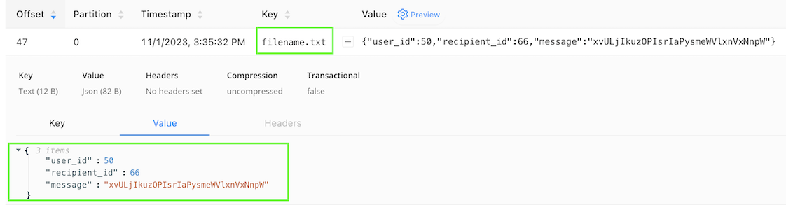

# Integration between Sterling B2Bi and Kafka
 
**Important**: Only support on Sterling B2B Integrator 6.2


## Consuming files from Kafka topic:  file **demo-kafka-consumer.bpml**

you must setup server connections

```XML
<assign to='BootStrapServers'>localhost:29092</assign>
<assign to='KafkaClientAdapter'>KafkaClientAdapter</assign>
<assign to='SecurityAction'>PLAINTEXT</assign>
<assign to='GroupId'>demo-sfg-consumer-0001</assign>
```

and define a topic
```XML
<assign to='Topic'>sb2b-kfk-inbound</assign>
```

## Consuming files from Kafka topic:  file **demo-kafka-producer.bpml**

you must setup server connections

```XML
<assign to='BootStrapServers'>localhost:29092</assign>
<assign to='KafkaClientAdapter'>KafkaClientAdapter</assign>
<assign to='SecurityAction'>PLAINTEXT</assign>
<assign to='ProducerConfig'>buffer.memory=102400;compression.type=gzip</assign>
```

and define a topic
```XML
<assign to='Topic'>sb2b-kfk-outbound</assign>
```


# Files

| File name                           |            Description of BP                                          |
|-------------------------------------|-----------------------------------------------------------------------|
| demo-kafka-consumer.bpml    | Business Process to consume (get) files from Kafka|
| demo-kafka-producer.bpml    | Business Process to produce (put) files to Kafka|
| consumer.py                 | Python code to consume (get) files from Kafka|
| producer.py                 | Python code to produce (put) files to Kafka|


# Steps to Run:


**On Dashboard**

1) Login o Sterling B2B Console

2) Create a new Business Process: **Demo_Kafka_Producer**, using file **demo-kafka-producer.bpml** 

3) Create a new Business Process: **Demo_Kafka_Consumer**, using file **demo-kafka-consumer.bpml** 

4) Run the BP and check result on steps on B2Bi Dashboard.


To test you can use my python scritps producer.py and consumer.py

For any problem check BP 




**Important**

1) Important: key must be the filename of file..


