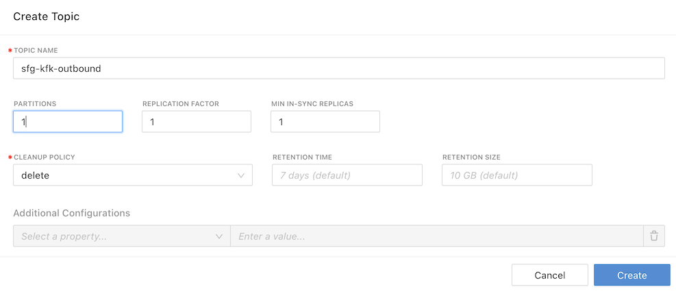
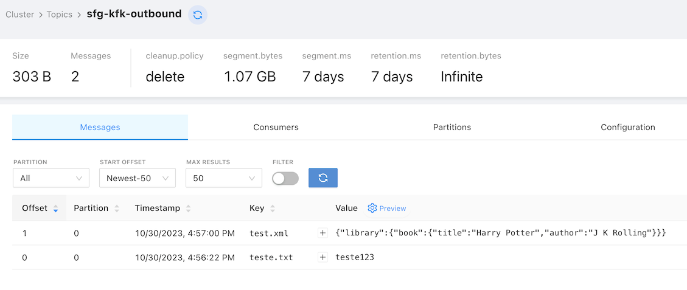

# IBM Sterling File Gateway Scenarios

In this scenario, we enable SFG to put a file on a Kafka Top

We need to add a Custom Protocol on SFG. And after need to define this protocol to a partner.


# Important 

[IBM Sterling B2B: Configuring SB2Bi to use Kafka](https://ebasso.net/wiki/index.php?title=IBM_Sterling_B2B:_Configuring_SB2Bi_to_use_Kafka)


# Files

| File name                       |            Description of Role                                          |
|---------------------------------|-------------------------------------------------------------------------|
| route-via-kafka.bpml            | Business Process that act as Kafka Producer |
| AFTExtensionsCustomer.xml       | Sample file AFTExtensionsCustomer.xml |
| AFTExtensionsCustomer.properties| Sample file AFTExtensionsCustomer.properties |


# Steps to Run:

**On Dashboard**

1) Create a new Business Process: **Demo_BP_RouteViaKafka**, using file **route-via-kafka.bpml** 

**On Dashboard Customizations**

3) Open B2Bi Dashboard

4) Select **Customization > Customization**. 

5) Click the **Click Here To Access** link. 

6) In the Customization login screen, enter the User Name and Password and click Login.

```
YOU MUST HAVE APIUser Permission
```

7) Click **CustomSFGExtensions**. The CustomSFGExtensions list page is displayed.
   
8) Click the **AFTExtensions Customer file** link. On the **General** tab, click **Edit**.

9) Click **Browse** to select ***AFTExtensionsCustomer.xml*** file and ***AFTExtensionsCustomer.properties*** file and click **SaveCustomSFGExtensions**.

10) Run <install_dir>/bin/deployer.sh.

11) Restart B2Bi


**On Filegateway - First Time Only**


1) Enable **Custom Kafka Protocol** on Community Protocols

**On Server machine - First Time Only**

**On Filegateway**

1) Create a Partner to Receive Files:Kafka_Topic_001

2) Create a Partner to Receive Files, choose **Custom Kafka Protocol**, and specify Remote Folder Name

```
Partner Name:          Kafka_Topic_001
Phone:                 55555
Email Address:         demo@demo.com
User Name:             Kafka_Topic_001
Authentication Type:   Local
Session Timeout (min): 15
Given Name:            Kafka_Topic
Surname:               001
Partner Role:          Consumer of Data
Connection Direction:  Listen Connection
Transport Method:  	Custom Kafka Protocol 	  	 
  BootStrap Servers: localhost:29092 
  Kafka Client Adapter: KafkaClientAdapter 
  Security Action: PLAINTEXT
  Topic: sfg-kfk-outbound 
  Procer Configs: buffer.memory=102400;compression.type=gzip 

Does Kafka_Topic_001 require data to be signed by the Router: no
Does Kafka_Topic_001 require data to be encrypted by the Router : no
```

3) Create a Routing Channel Template.

```
 Routing Channel Template:
    Template Name: W_SEND_FILE
    Consumer Identification: Not Dynamic

    Special Character Handling: No special character handling is specified
    Provisioning Fact List:
    Group Permissions:
        Producer Group: All Partners
        Consumer Group: All Partners
    Producer Mailbox Path: /${ProducerName}/${ConsumerName}
    Producer File Structures:
        Producer File Structure: Unknown{.+}
        Layer: Unknown
            File name pattern as regular expression: .+
            File name pattern group fact names, comma delimited:
    Delivery Channel Templates:
        Delivery Channel Template:
            Consumer Mailbox Path: /${ConsumerName}/Inbox
            Consumer Mailbox: Created at runtime
            Consumer Protocol: protocol or mailbox
            Consumer File Structure: Unknown{${ProducerFileName}}
            Layer: Unknown
                File name format: ${ProducerFileName}
```

4) Create a Route Channel.

* Routing Channel Template: W_SEND_FILE
* Producer: Demo_Producer_01
* Consumer: Kafka_Topic_001


**On Kafka**

1) Create a topic: **Demo_BP_RouteViaKafka**, using file **route-via-kafka.bpml** 



# Running

1) Logon on Myfilegateway with user **Demo_Producer_01**, and upload any file to virtual directory **/Kafka_Topic_001**

2) Check at Topic




