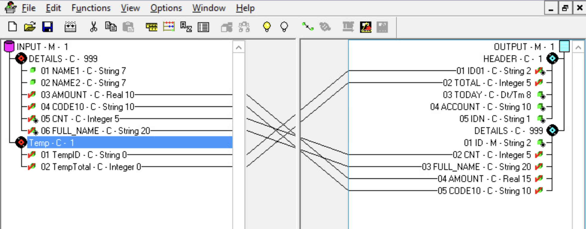

# IBM Map Editor - Example 01

In this scenario, 

* input.txt -- Source file
* output.txt -- Result file
* MapPos2CsvSample01.mxl -- Map Source Code
* MapPos2CsvSample01.txo -- Map Compiled Version

## Map Configuration

## Input File description

Positional file 

| Field    | Description of Role  | Type   | Pos | Size | Default Value |
|----------|----------------------|---------------------------------------------------|
| Register | Register description | Number |   1 |    3 | 123 |
| NAME1    | Name                 | String |   4 |    7 | |
| NAME2    | Surname              | String |  11 |    7 | |
| AMMOUNT  | Ammout Value         | Number |  19 |   10 | |
| CODE     | Code (Sample)        | String |  29 |   10 | |
